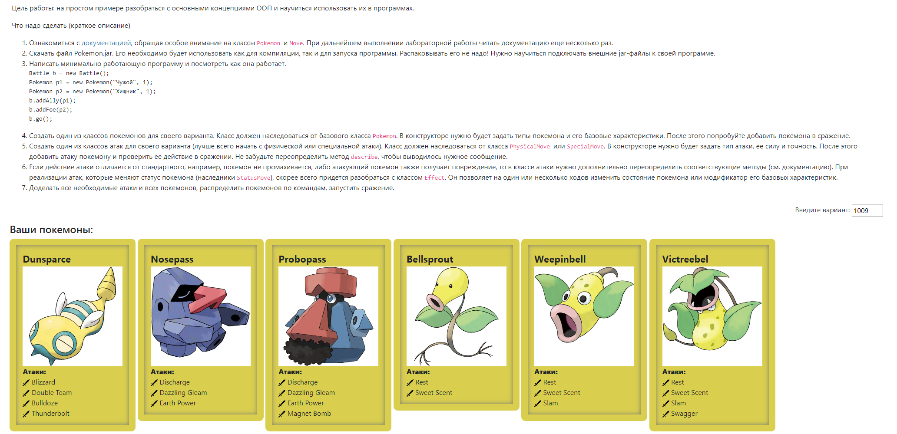

# Laboratory work № 2

## Задание

## Отчёт по лабораторной работе должен содержать:

- Текст задания.
- Диаграмма классов реализованной объектной модели.
- Исходный код программы.
- Результат работы программы.
- Выводы по работе.

## Вопросы к защите лабораторной работы:

- Объектно-ориентированное программирование. Основные понятия: объекты, **наследование**, **полиморфизм**,
  **инкапсуляция.**
- Понятие класса. Классы и объекты в **Java**.
- Члены класса. Модификаторы доступа.
- Создание и инициализация объектов. Вызов методов.
- Области видимости переменных.
- Модификаторы **final** и **static**.
- Пакеты, инструкция **import**.
